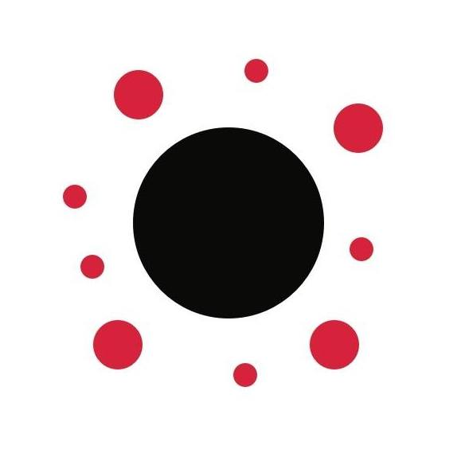

# Vaccines and Therapeutics Task Force Repo



## About CoronaWhy

CoronaWhy is a crowd-sourced team of over 350 engineers, researchers, project managers, and all sorts of other professionals with diverse backgrounds who joined forces to tackle the greatest global problem of today--understanding and conquering the COVID-19 pandemic. This team formed in response to the Kaggle CORD-19 competition to synthesize the flood of new knowledge being generated every day about COVID-19. The goal for the organization is to inform policy makers and care providers about how to combat this virus with knowledge from the latest research at their disposal.

## About the V&T Task

The Kaggle CORD-19 challenge is divided into 10 tasks. The V&T team is focused on the following question: **[What do we know about vaccines and therapeutics](https://www.kaggle.com/allen-institute-for-ai/CORD-19-research-challenge/tasks?taskId=561)?**

The page linked above provides more details about the sorts of things that the end-users are looking for from this task, including such items as which drugs are being used or proposed for treating COVID-19 and what evidence exists that these treatments might be effecive. On first glance, the task posed is rather vague--however, the task allows flexibility and creativity for distilling and presenting insights to end-users for drug and vaccine treatments.

## About the V&T Task Force

The V&T Task Force is a subgroup of the CoronaWhy team, which is focused on contribuing to the V&T Task. The team is currently being led by Dan (@dnsosa) and Aleksei (@aleksei), please direct any inquiries or issues with permissions to either of these two.

Currently, the V&T Task Force has plans to work towards [3 concrete deliverables](https://docs.google.com/spreadsheets/d/16kYZPYFMR2n4EcLXexVz-lZee03ofZNEVe-8ke-Os4U/edit#gid=1608970502) for the Therapeutics half of the challenge: 
1. A summary table much like the ones previously discussed [here](https://www.kaggle.com/covid-19-contributions) and [here](https://www.kaggle.com/allen-institute-for-ai/CORD-19-research-challenge/discussion/138484#788765). We intend for this table to provide information on drug treatments being considered, evidence supporting these treatments (e.g. clinical vs experimental vs computational), and relevant citations providing evidence for these treatments. 
2. A knowledge graph representation of drug and disease mechanisms. This will consist of relations extracted from literature that might help explain methods of action for drugs being proposed for repurposing.
3. Meta-analysis(es) of drugs with sufficient known information. Note, it is very possible no drug has sufficient information to conduct a meta-analysis.

## Getting Started

We have divided the work needed to create these deliverables into subtasks and broken subtasks into more atomic subsubtasks that can be worked on by individual V&T Task Force contributors.

To get started working with this repo please see the [Getting Started Guide](https://github.com/CoronaWhy/task-vt/wiki/Getting-Started-Guide). Also check out if any [Existing Resources](https://github.com/CoronaWhy/task-vt/wiki/Interesting-External-Resources) might be helpful to get you started.

Best of luck and thank you for all your hard work in this fight.

### Installation of this code

Install in development mode with:

```sh
git clone https://github.com/CoronaWhy/task-vt.git
cd task-vt
pip install -e .[docs]
```

- `-e` installs in editable mode
- `.` says install the current directory
- `[docs]` says install the extra requirements for building the docs

Install in read-to-go-mode with:

```sh
pip install git+https://github.com/CoronaWhy/task-vt.git
```

Now, code that's in the `src/coronawhy_vt` folder can be imported like this:

```python
from coronawhy_vt import version
print(version.get_version())
```

### Build the docs

After installation, do the following to build and open the docs (sorry windows users,
you're out of luck):

```sh
cd docs/
make html
open build/html/index.html
```

Note: ReadTheDocs will take care of auto-building the docs on every commit to master,
so you don't have to worry about this. Also, because of this, don't commit the
build artifacts to GitHub!
